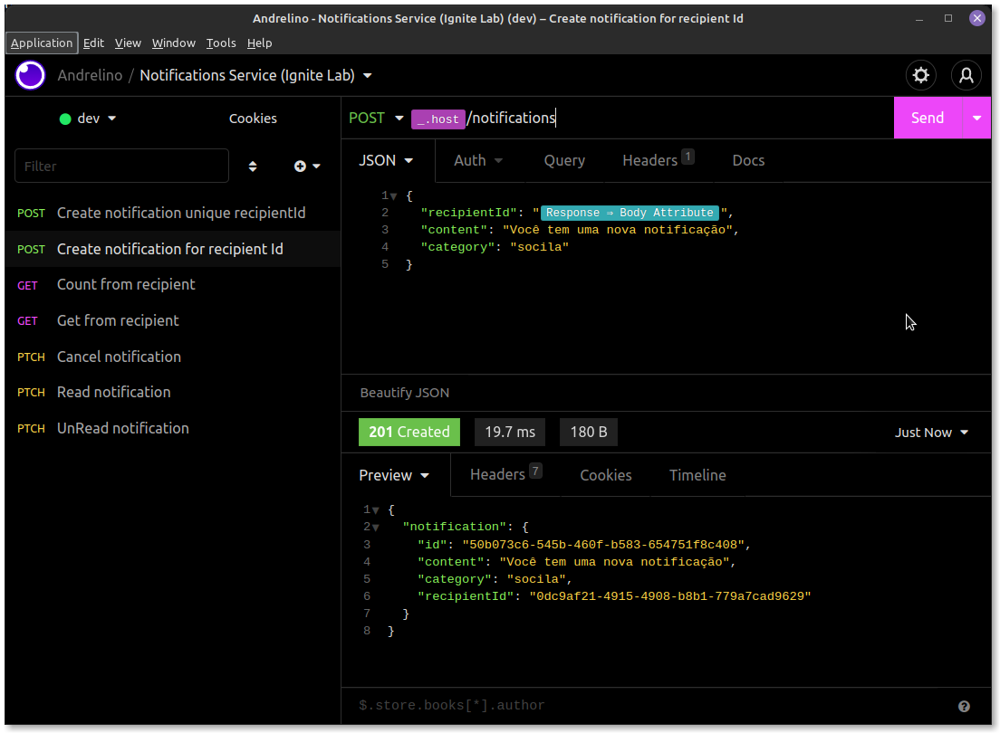

<div align="center" id="top">
  
</div>

<h1 align="center">Notifications Service</h1>

<p align="center">
  

  

  

  

  <!--  -->

  

  
</p>

<!-- Status -->

<!-- <h4 align="center"> 
	🚧  Notifications Service 🚀 Under construction...  🚧
</h4> 

<hr> -->

<p align="center">
  <a href="#about">About</a> &#xa0; | &#xa0;
  <a href="#features">Features</a> &#xa0; | &#xa0;
  <a href="#technologies">Technologies</a> &#xa0; | &#xa0;
  <a href="#requirements">Requirements</a> &#xa0; | &#xa0;
  <a href="#starting">Starting</a> &#xa0; | &#xa0;
  <a href="#license">License</a> &#xa0; | &#xa0;
  <a href="https:andrelino.dev" target="_blank">Author</a>
</p>

<br>

## About ##

This project aims to create and manage the notifications of a system in an organized and well be structured way. Developed during Rocketseat Education's Ignite Lab Classes ([@rocketseat-education](https://github.com/rocketseat-education))

## Features ##

:heavy_check_mark: Create notification;\
:heavy_check_mark: List notification recipient by id;\
:heavy_check_mark: Count notifications from recipient id;\
:heavy_check_mark: Get recipient data from notification id;\
:heavy_check_mark: Cancel notification by id;\
:heavy_check_mark: Mark notification as read;\
:heavy_check_mark: Mark notification as unread;\
:heavy_check_mark: Persist information to database;

**Nota:**
Database options to persist data <https://www.prisma.io/docs/concepts/database-connectors#overview>

## Technologies ##

The following tools were used in this project:

- [Node.js](https://nodejs.org/)
- [Nest.js](https://nestjs.com/)
- [Jest.js](https://jestjs.io/)
- [Prisma](https://www.prisma.io/)
- [TypeScript](https://www.typescriptlang.org/)
- [Kafka.js](https://kafka.js.org/)

### Other tools ###

- [Upstash](https://upstash.com/)
-- Create new Cluster
-- Insert a name
-- Select a region
-- Click Create to continue

## Requirements ##

Before starting :checkered_flag:, you need to have [Git](https://git-scm.com) and [Node](https://nodejs.org/en/) installed.

## Starting ##

- Access your terminal
- Execute commands bellow:

  ```bash
  # clone project
  $ git clone https://github.com/andrelinos/notifications-service.git

  # Access project folder 
  cd notifications-service
  ```

- Access [here](README-NESTJS.md) and follow steps to continue

## Command

```bash
# Execute application
$ yarn start

# Create a new notification message
$ yarn create:producer
```

## The server will initialize in the <http://localhost:3000>

## Routes application ##

- Create (POST): <http://localhost:3000/notifications>

```json

{
 "recipientId": "0dc9af21-4915-4908-b8b1-779a7cad9629",
 "content": "Você tem uma nova notificação",
 "category": "social"
}

```

- Count from recipient (GET): <http://localhost:3000/notifications/count/from/0dc9af21-4915-4908-b8b1-779a7cad9629>

```json
{
  "count": 2
}
```

- Get content from recipient (GET): <http://localhost:3000/notifications/from/0dc9af21-4915-4908-b8b1-779a7cad9629>

```json
{
  "notifications": [
    {
      "id": "e44e7c26-8939-4d22-8834-c539ba2d0949",
      "content": "Você tem conta pra pagar",
      "category": "mega",
      "recipientId": "0dc9af21-4915-4908-b8b1-779a7cad9629"
    },
    {
      "id": "e92af443-40fd-4c86-90a2-069a4cd3b9bf",
      "content": "Você tem conta pra pagar",
      "category": "mega",
      "recipientId": "0dc9af21-4915-4908-b8b1-779a7cad9629"
    }
  ]}
```

- Cancel notification (PATCH): <http://localhost:3000/notifications/0dc9af21-4915-4908-b8b1-779a7cad9629/cancel>
- Mark as read notification (PATCH): <http://localhost:3000/notifications/0dc9af21-4915-4908-b8b1-779a7cad9629/read>
- Mark as unread notification (PATCH): <http://localhost:3000/notifications/0dc9af21-4915-4908-b8b1-779a7cad9629/unread>

## License ##

This project is under license from MIT. For more details, see the [LICENSE](LICENSE.md) file.

Made with :heart: by <a href="https://github.com/andrelinos" target="_blank">Andrelino Silva</a>

&#xa0;

<a href="#top">Back to top</a>
